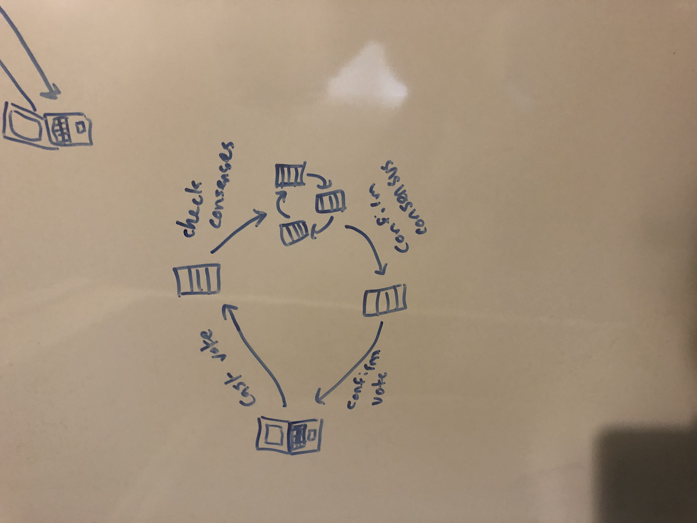

# BlockBallot

BlockBallot is a blockchain-based voting web application created for HackNC!

Learning resource: https://developer.ibm.com/technologies/blockchain/tutorials/develop-a-blockchain-application-from-scratch-in-python/

## System Design


We have created a distributed ledger where each node must achieve consensus with every other node to ensure the integrity of the data.
This prevents altered or illegal data from being entered into the system.

## Authors

- Paul Jones, University of North Carolina at Chapel Hill
- Josh Chang, Purdue University

## Installation

Clone this repository to run this application.

```bash
```

## Usage

```bash
```

## Contributing
Pull requests are welcome. For major changes, please open an issue first to discuss what you would like to change.

Please make sure to update tests as appropriate.

## License
[MIT](https://choosealicense.com/licenses/mit/)
